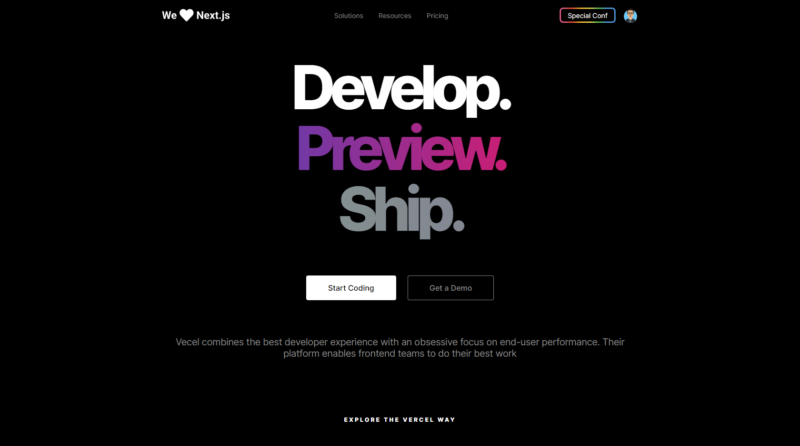
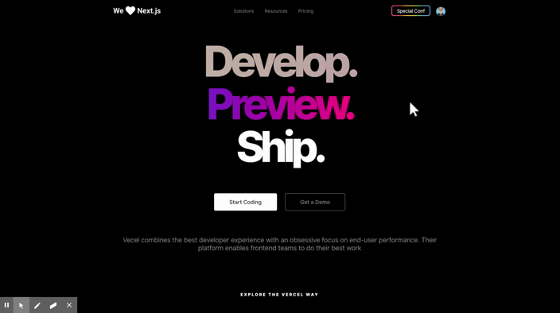

<h1 align="center">
    
</h1>

<h1 align="center">Vercel Homepage UI Clone</h1>

<h4 align="center">

[View demo](#-demonstration) · [Report bug](#-contributing)
    
</h4>

<h2> 📘 Index </h2> 

- [👨‍🏫 About](#-about)
- [🚀 Technology](#-technology)
- [🎬 Demonstration](#-demonstration)
- [☕ Prerequisites](#-prerequisites)
- [🔧 Installing](#-installing)
- [💿 Using](#-using)
- [📮 Contributing](#-contributing)
- [🤟 Collaborators](#-collaborators)
  - [😎 Become a contributor](#-become-a-contributor)
- [📜 License](#-license)

## 👨‍🏫 About 

Project developed from a video on the [Rocketseat YouTube channel.](https://www.youtube.com/channel/UCSfwM5u0Kce6Cce8_S72olg) 💜

- [x] [Video: Recriando homepage da Vercel | UI Clone #17](https://www.youtube.com/watch?v=204ewU7NRO0) 🎥

## 🚀 Technology 

- [x] [Sass](https://sass-lang.com/)

## 🎬 Demonstration

<h1 align="center">
    
</h1>

<h1 align="center">
    
</h1>

## ☕ Prerequisites

Before getting your hands dirty, make sure you meet the following requirements: 

- [ ] Have the [Live Server](https://marketplace.visualstudio.com/items?itemName=ritwickdey.LiveServer) extension installed
- [ ] Have the [Live Sass Compiler](https://marketplace.visualstudio.com/items?itemName=ritwickdey.live-sass) extension installed

## 🔧 Installing 

To install, follow the steps:

```bash
## Clone the repository

git clone https://github.com/LeonardoCampello-dev/Homepage-Vercel.git
```

## 💿 Using

To use, follow the steps:

To use the project is very simple. Just right-click on the ``index.html`` and select the option **"Open with Live Server"**

> Remembering that, for that you need to have the extension installed.

## 📮 Contributing 

If this is your first contribution, [see the following tutorial.](https://github.com/firstcontributions/first-contributions)

## 🤟 Collaborators 

We thank the following developers who contributed:  

<table>
  <tr>
    <td align="center">
      <a href="https://github.com/LeonardoCampello-dev">
         <br>
        <sub>
          <b>Leonardo Campello</b>
        </sub>
      </a>
    </td>
    <td align="center">
      <a href="https://github.com/guilhermerodz">
         <br>
        <sub>
          <b>Guilherme Rodz</b>
        </sub>
      </a>
    </td>
  </tr>
</table>

### 😎 Become a contributor  

Would you like to be part of this project? Click [HERE](https://github.com/firstcontributions/first-contributions) and read the instructions to contribute.

## 📜 License

Made in 2020. This project is under the [MIT license.](/LICENSE)

<h2> Made with 💚 by Leonardo Campello </h2>